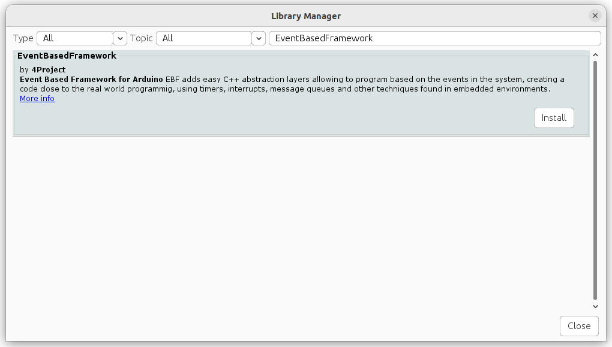
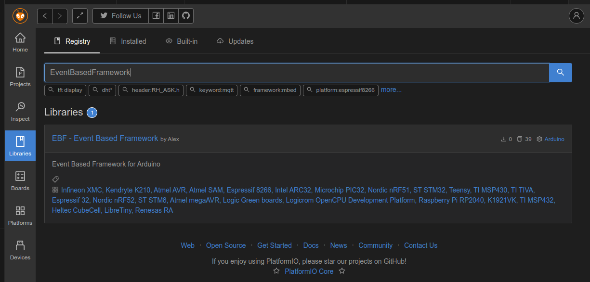
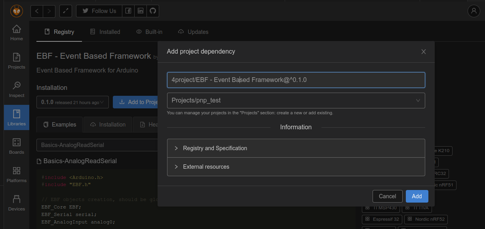

# EBF - Event Based Framework
EBF is a framework for Arduino environment, providing the timers infrastructure and C++ abstraction layers for the services provided by the Arduino device.
Development with such framework allows you to concentrate on the logic of your project, creates cleaner code and easier for the beginners.

Currently only boards based on the ATMega328 chip are supported (Arduino UNO, Arduino Nano), as well as boards based on the SAMD21 chip.
There are many SAMD based boards since this chip is very powerfull compared to the ATMega328 and gain more and more popularity.
We use SparkFun's SAMD21 Mini board (SKU: DEV-13664) for the development and testing of the code, but there are many other good boards, such as Arduino's MKR line, SeedStudio XIAO SAMD21, Adafruit Feather M0 and few others that should work with EBF.

# The problem
The Arduino envirnment is based on "linear" execution of the code, meaning each line is executed one after the another.
Here's an example of the Blink code:
```
// the loop function runs over and over again forever
void loop() {
  digitalWrite(LED_BUILTIN, HIGH);  // turn the LED on (HIGH is the voltage level)
  delay(1000);                      // wait for a second
  digitalWrite(LED_BUILTIN, LOW);   // turn the LED off by making the voltage LOW
  delay(1000);                      // wait for a second
}
```

While it might be eaiser to understand such code, when you try to implement something a bit more complex than a blinking led, handle several components, such as buttons, switches, motors, sensors and so on, you can't just delay the execution as it's done in the blink example.

Did you ever try to add a button that will turn on another led to the blink example?
You will discover that the button is non-responsive due to the delays in the code.
Reducing the delay will make the button more responsive, but the timing for the first led will change.
The solution that Arduino proposes, is to use the "Blink Without Delay" method, where the loop of the `delay()` function is just moved to your main `loop()` and you have to keep track of the passed time in your code.
It will work, but the code quickly grows into a spaghetti just for those simple components such as blinking a led in a specific frequency and having another led, which is turned on when a button is pressed.
Just imagine the mess you will get into when you'll try to add even more components, such as sensors and motors.

In other words, the code you will get will mostly be around the control path (when to do things) instead of the logic you want to implement (what to do).
The solution for that are timers and events that will call your code to execute the logic you want to concentrate on.
That creates a cleaner and more understandable code. And for those who are new to the embedded world, the code will be way closer to the real-life code, when you'll develop in a more advanced environment, with an embedded operating system perhaps. You just don't `delay()` in your code, instead you rely on timers.
```
// LED Timer callback function
void onTimer()
{
  // Set the LED digital output to the new state
  ledState = !ledState;
  led.SetValue(ledState);

  // EBF timers are one-shot in nature, restart it
  EBF.StartTimer(LED_TIMER);
}
```

# The solution
The Event Based Framework (EBF) provides the timers infrastructure and C++ abstraction layers for the Arduino board hardware (such as Digital Input, Digital Output, Analog Input, Serial and others), which will call your functions to perform the logic you would like to execute.
For example, digital and analog inputs will call your function when an input changes.
```
// Button change callback function
void onButtonChange()
{
  // Read the button state
  uint8_t buttonState = button.GetValue();

  // Set the LED based on the button state
  led.SetValue(buttonState);
}
```

Serial will call your function when there is data to read. 
```
// Serial data callback function
void onSerial()
{
  byte brightness;

  // read the most recent byte (which will be from 0 to 255):
  brightness = serial.read();

  // set the brightness of the LED:
  led.SetValue(brightness);
}
```

## No more polling
The EBF core will do all the polling needed to detect those changes for you, will check when the right time passes to call your function.
That implementation allows power saving since all the timing is done in a cetralized code. When the EBF core knows that there is enough time to save some power, it might put the CPU into IDLE or PowerDown mode.
You have control over the polling intervals, so instead of adding `delay()` to different parts of the code if you don't need an input to be polled too fast, just call the 'SetPollInterval()' function during setup.
```
// Initialize knock sensor on A0, for 1% change
analogInput.Init(A0, onAnalogChange, 1);
// Will poll the input every 10 mSec
analogInput.SetPollInterval(10);
```

## Interrupts
Want to utilize the hardware interrupts instead of polling the ports to detect the change? No problem! 
There's almost no code should be changed. Just compile the EBF library with interrupts support and your callback functions will be called the same way as they were done while polling method was used.
The only change needed is to return the interrupt call (ISR) back to the EBF core, so it will call your function again from the normal run, where you can use Serial and other peripherials without blocking other interrupts.
If you need faster execution with some small code, like counting pulses from an encoder, you might want to execute that code in the first call to the callback function, so there might not be a need to pass the control back to the EBF.
```
void onButtonChange()
{
  uint8_t buttonState;

  // If the function is called from an interrupt (ISR mode)
  if (EBF.InInterrupt()) {
    // Pass the processing back to EBF
    EBF.ProcessInterrupt(button);
    // And return from that function
    return;
  }

  // The function will be called again, as a normal run and not from the interrupt

  // We use GetLastValue instead of the GetValue, to use the value that triggered
  // the callback. The digital input might change again since then
  buttonState = button.GetLastValue();

  // Use the LED and serial printouts as a visualization when the change was detected
  led.SetValue(buttonState);
  serial.print("Button changed to: ");
  serial.println(buttonState);
}
```

# Power save
Power saving is currently implemented for the SAMD21 chips. 
With the SparkFun's SAMD21 Mini board with power LED jumper open, in configuration with one pin as digital output (to show some signs of life), we managed to get down to 530 uA power consumption in deep sleep mode.
With onboard voltage regulator disconnected the consumption was only **22 uA**!

The only thing that your code have to do is enable the power saving by calling the `EBF.SetSleepMode()` function, all the implementation will be done in the core of the EBF.
The EBF keeps track of the time it will be idle till the next event, so it might put the CPU into sleep mode during those times.
For example, if there is a 1 second timer and digital input with 50 mSec polling interval, the core will know that it have only 50 mSec till the next task that should be executed.
When interrupts are enabled and the digital input uses inerrupt enabled pin, there will be no need for polling, since the interrupt will trigger the event, so the EBF might sleep for the whole 1 second in that case.

# Product abstract layer
In addition to Arduino hardware services abstraction (digital input, analog output), EBF provides real-life products abstraction, such as Led, Switch, Button and others.
Product abstraction implements mostly used logic for those products, such as software based debouncing for switches and buttons and extends the callbacks to more expected events such as `onButtonPress`, `onButtonRelease`, `onButtonLongPress`.
The EBF allows the objects to be time-aware. For example, if you want to blink a LED, just call the `Blink()` function. No need to delay or use timers:
```
// No timers needed to blink the LED, just call he Blink() function!
// The LED will be ON for 100mSec and OFF for 900mSec
led.Blink(100, 900);
```

Or fade-in and fade-out the LED to create breathing effect. As simple as that:
```
// LED Timer callback function
void onTimer()
{
  // Change the state every time the timer expires
  ledState = !ledState;

  if (ledState) {
    // The fading will be done during 900 mSec with 50 steps
    led.FadeIn(900, 50);
  } else {
    led.FadeOut(900, 50);
  }

  // EBF timers are one-shot in nature, restart it
  EBF.StartTimer(LED_TIMER);
}
```

Additional products implementation will be added later.

# Installation
We use PlatformIO to develop the EBF, but try to keep it compatible with the Arduino IDE (that's the reason for the strange directory tree).

The EventBasedFramework (EBF) is listed in the library managers of both platforms. You can install it using the platform library manager (the preferred way), or if you need a specific version of the EBF, or can't wait for the library managers to be updated, you can manually install the library from current repository, as explained below.

## Library managers
### Arduino IDE
In Arduino IDE, go to **Tools** > **Manage Libraries...** menu. Wait few seconds for the **Library Manager** window to open with the list of all available libraries.

Type `EventBasedFramework` in the **Filter your search...** field. The list will show matching libraries for that search, in our case only the EBF:


Press the **Install** button to install the EBF library.

After the installation, you will find multiple examples in the Arduino's IDE **File** > **Examples** > **EventBasedFramework** menu. You might need to scroll down the list in the **Examples** menu to find the **EventBasedFramework** entry.

Library installed using that method is available for all the projects on that computer.

### PlatformIO
Click the "Alien" icon to get to the PlatformIO menus. Click on the **Libraries** icon and type `EventBasedFramework` in the **Search libraries...** field in the Libraries Registry screen.\
Click on the magnifier glass icon to perform the search or press Enter.\
The list show the **EventBasedFramework** entry. Click on it's blue name:


The screen will show the selected library information with examples and some code.\
You will see the latest version of the library (you can change what version to install). Press the **Add to Project** button.\
Another window will open showing the selected version in the first field and ask you to select the project where you would like to add the EventBasedFramework library.


Click the **Add** button to complete the installation.

In PlatformIO there is a separation between the projects, so the EBF library will be installed to a specific project only.

You can start using the examples for the EBF after the installation.\
Pay attention that all the examples are with `.ino` extension file, as required in Arduino IDE.\
You can simply copy and paste the relevant pieces of code to your `main.cpp` file, or other `.cpp` file in your project's `src` directory.

## Manual installation
Manual installation of the EBF library to both Arduino IDE and PlatformIO environments is similar. Download this repository content as a ZIP file (Click on the green "<> Code" button on the top of GitHub's page and "Download ZIP" from the menu),
and extract the ZIP content into your environment's library directory. Change the extracted directory name from "EBF-master" to "EventBasedFramework" or "EBF" to make it more readable.

For **PlatformIO** on Linux system:
```
[Your PlatformIO path]/Projects/[Your project name]/lib/
```
For **Arduino 1.6.x and up** on Linux system:
```
~/Arduino/libraries/
```

# Examples
Multiple examples are ready for you in the [examples](https://github.com/4project-co-il/EBF/tree/master/examples) directory.

# Bugs and requests
Please submit bug reports and requests for new features via [GitHub's Issues](https://github.com/4project-co-il/EBF/issues) system

